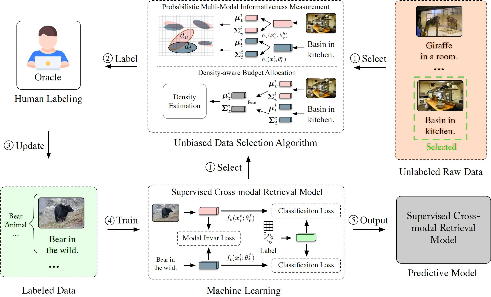

# Active Learning Supervised Cross-Modal Retrieval (ASCMR)
PyTorch implementation of ASCMR.

<div align="center">
  
</div>

The code includes the implementations of all the baselines presented in the paper. Parts of the code are borrowed from https://github.com/JordanAsh/badge.

## Setup
The dependencies are in [`requirements.txt`](requirements.txt). Python=3.8.3 is recommended for the installation of the environment.


## Datasets
 
You can download the features of the datasets from:

MIRFlickr, [OneDrive](https://pkueducn-my.sharepoint.com/:f:/g/personal/zszhong_pku_edu_cn/EpLD8yNN2lhIpBgQ7Kl8LKABzM68icvJJahchO7pYNPV1g?e=IYoeqn), [BaiduPan(password: b04z)](https://pan.baidu.com/s/1g1c7Ne7y1BDys6pMh2yhYw)
NUS-WIDE (top-21 concepts), [BaiduPan(password: tjvo)](https://pan.baidu.com/s/1JEokBLtpQkx8JA1uAhBzxg)
MS-COCO, [BaiduPan(password: 5uvp)](https://pan.baidu.com/s/1uoV4K1mBwX7N1TVmNEiPgA)


## Implementation

The supervised cross-modal retrieval implementation are followed by [GNN4CMR](https://github.com/LivXue/GNN4CMR).
The active learning process are followed by [ALFA-Mix](https://github.com/AminParvaneh/alpha_mix_active_learning).

## Training

```python
python main.py \
        --data_name NUS-WIDE-TC21 --data_dir data/NUS-WIDE-TC21/ --log_dir log_only_label_retrain_sim_gcn --n_init_lb 500 \
        --n_query 500 --n_round 10 --learning_rate 0.00005 --n_epoch 1000 --model dagnn \
        --strategy $STRATEGY --alpha_opt --cuda_visible_devices 2 --map_threshold 0.99
```
